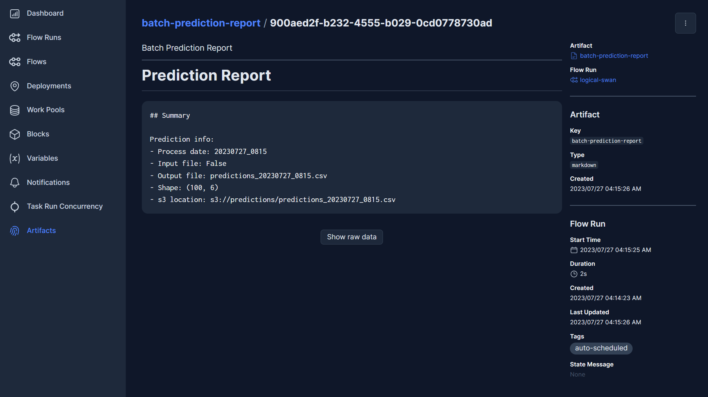

# MLOps Zoomcamp Project: Real estate price prediction

Project for MLOps Zoomcamp from DataTalks.Club. 

More info at [mlops-zoomcamp](https://github.com/DataTalksClub/mlops-zoomcamp.git)

## Author
* Name: Sebastián Contreras Zambrano
* LinkedIn: [Profile](https://www.linkedin.com/in/sebastian-cz/)

## Certification

Update as of August 14, 2023: I have received the completion certificate. You can check it out [here](https://certificate.datatalks.club/mlops-zoomcamp/2023/e07e5ad344bc7f981489da5f608c3dd68d668522.pdf)

## Table of Contents

1. [Problem description](#problem-description)
2. [About data](#about-data)
3. [Technologies](#technologies)
4. [Project diagram](#project-diagram)
5. [Project schema](#project-schema)
6. [How to setup the project](#how-to-setup-the-project)
7. [Generating predictions](#generating-predictions)
8. [Visualizating the metrics](#visualizating-the-metrics)
9. [About the tests](#about-the-tests)

## Problem description:

The main objective of the project is to predict __the price of housing per unit area__ based on data provided in Kaggle. To achieve this goal, regression machine learning models will be trained. The best hyperparameters will be searched, and the optimal model will be selected based on the metrics obtained from the holdout subset of the data. These experiments will be tracked using MLFlow. The resulting models will be stored in an AWS S3 bucket, and the training metrics will be calculated using Evidently reports and stored in PostgreSQL.

Once the model is trained, predictions can be made in batch mode by sending CSV files hosted in S3 or locally. This process will trigger the file reading, model predictions, storage of the results in an S3 bucket, and finally, the recording of the monitoring metrics (drift).

Additionally, the project includes the development of an API that returns the price of housing per unit area based on the attributes indicated in the body of the request. The batch process can also be called by sending the S3 URI of the file.

All the mentioned processes will be orchestrated with the Prefect platform, and the visualization of the metrics will be through Grafana.

## About data:

### Source: 
[https://www.kaggle.com/datasets/quantbruce/real-estate-price-prediction](https://www.kaggle.com/datasets/quantbruce/real-estate-price-prediction)

### Summary:

The dataset has various features associated with housing properties and their corresponding unit area prices at a specific location. The goal of this machine learning problem is to develop a predictive model that can accurately estimate the price of a property per unit area based on the given features.

The dataset includes the following columns:

- `No`: A unique identifier for each record in the dataset.
- `X1 transaction date`: The date of the property transaction, likely represented in a year.month format.
- `X2 house age`: The age of the house in years, serving as a measure of its condition.
- `X3 distance to the nearest MRT station`: The distance in meters from the property to the closest Mass Rapid Transit (MRT) station, indicating transportation convenience.
- `X4 number of convenience stores`: The count of convenience stores in the vicinity of the property, reflecting the area's amenities and attractiveness.
- `X5 latitude`: The geographic latitude coordinate of the property's location.
- `X6 longitude`: The geographic longitude coordinate of the property's location.
- `Y house price of unit area`: The target variable, representing the price of the property per unit area, which is the value we aim to predict.

The input features (X1 to X6) will be used to train the model, and the target variable (Y) will be the value to predict for new, unseen data points. The performance of the model will be evaluated based on metrics such as Mean Average Error (MAE), Root Mean Squared Error (RMSE) and the Coefficient of Determination (R<sup>2</sup>) to measure the predictive accuracy of the model on unseen data.

## Technologies

- Cloud: AWS via localstack
- Experiment tracking: MLFlow
- Workflow orchestration: Prefect
- Monitoring: Evidently
- Packaging tool: Pipenv

## Project diagram


## Project schema:

```
📦ml-ops-zoomcamp-project
 ┣ 📂real_estate_model
 ┃ ┣ 📂api
 ┃ ┃ ┣ 📜__init__.py
 ┃ ┃ ┣ 📜prediction_api.py
 ┃ ┃ ┗ 📜run.py
 ┃ ┣ 📂config
 ┃ ┃ ┣ 📜grafana_dashboards.yaml
 ┃ ┃ ┗ 📜grafana_datasources.yaml
 ┃ ┣ 📂dashboards
 ┃ ┃ ┣ 📜batch_metrics.json
 ┃ ┃ ┗ 📜training_metrics.json
 ┃ ┣ 📂data
 ┃ ┃ ┗ 📜Real estate.csv
 ┃ ┣ 📂flows
 ┃ ┃ ┣ 📜model_batch_metrics.py
 ┃ ┃ ┣ 📜model_batch_prediction.py
 ┃ ┃ ┣ 📜model_train_metrics.py
 ┃ ┃ ┣ 📜model_training.py
 ┃ ┃ ┗ 📜simulate_data.py
 ┃ ┣ 📂images
 ┃ ┃ ┣ 📜batch_metrics.png
 ┃ ┃ ┣ 📜batch_pred_artifact.png
 ┃ ┃ ┣ 📜diagram.drawio
 ┃ ┃ ┣ 📜diagram.png
 ┃ ┃ ┣ 📜prefect_batch.png
 ┃ ┃ ┣ 📜prefect_train.png
 ┃ ┃ ┗ 📜training_metrics.png
 ┃ ┣ 📂scripts
 ┃ ┃ ┣ 📂localstack
 ┃ ┃ ┃ ┣ 📜Dockerfile
 ┃ ┃ ┃ ┗ 📜init-aws.sh
 ┃ ┃ ┣ 📜init_database.sql
 ┃ ┃ ┣ 📜register_flows.py
 ┃ ┣ 📂tests
 ┃ ┃ ┣ 📂integration
 ┃ ┃ ┃ ┗ 📜test_api.py
 ┃ ┃ ┗ 📂unit
 ┃ ┃ ┃ ┣ 📜test_batch_prediction.py
 ┃ ┃ ┃ ┗ 📜test_functions.py
 ┃ ┣ 📂utils
 ┃ ┃ ┗ 📜functions.py
 ┃ ┗ 📜__init__.py
 ┣ 📜.gitignore
 ┣ 📜Dockerfile
 ┣ 📜Makefile
 ┣ 📜Pipfile
 ┣ 📜Pipfile.lock
 ┣ 📜README.md
 ┣ 📜docker-compose.yml
 ┗ 📜pyproject.toml
```

## How to setup the project:

1. Clone the project repository:
```bash
git clone https://github.com/sebastiancontz/ml-ops-zoomcamp-project.git
```
2. Install `docker-compose` version 3.
3. Go to the project directory:
```bash
cd ml-ops-zoomcamp-project/
```
4. Build the project with the Makefile:
```bash
make build
```
5. The process of building will automatically run the unit tests. If all the tests pass, the project will be ready to run. However, if the tests fail, the project will not be built.
6. Once the image is built and the service is up, the following services will be available:

|   service   | port  | Interface  |          url           |       description       |
|------------ |------ |----------- |----------------------- |------------------------ |
| API         | 5010  | 127.0.0.1  | http://127.0.0.1:5010  | API prediction service  |
| Prefect     | 4200  | 127.0.0.1  | http://127.0.0.1:4200  | Prefect UI              |
| MLFlow      | 5000  | 127.0.0.1  | http://127.0.0.1:5000  | MLFlow UI               |
| Grafana     | 3000  | 127.0.0.1  | http://127.0.0.1:3000  | Grafana UI              |
| PostgreSQL  | 5432  | 127.0.0.1  | http://127.0.0.1:5432  | Postgres database       |

7. Access [Prefect Deployments](http://127.0.0.1:4200/deployments) and run the `model_training` flow with `Quick run`. 


8. _-Optional-_  If you want to examine the experiments, access [MLFlow UI](http://127.0.0.1:5000).

9. Alternative you can trigger the `model_training` flow on prefect through the `/trigger-training` endpoint (default [http://127.0.0.1:5010/trigger-training](http://127.0.0.1:5010/trigger-training)).
    - The JSON schema should be as follows:
    ```json
    {
        "s3_file_path": "s3://some_bucket/train_data.csv"
    }
    ```
    - If you sent a logic false in the `s3_file_path` key, model will be trained with the default training data.
    ```json
    {
        "s3_file_path": false
    }
    ```
10. _-Optional-_  To close the project, run the following command:
```bash
make kill
```

## Generating predictions:

1. Once the model is trained, you can begin to make predictions, which can be done in three ways:
    1. Batch predictions through Prefect with the `batch_prediction` flow.
        - If you don't provide the S3 URI of the data, the project will simulate 100 records by sampling values from the training dataset.
        - Alternatively, you can provide a file path to make the prediction, and the format must be the same as the training data.
        
    2. Streaming prediction through the Flask API:
        - Send a JSON to the `/predict` endpoint (default [http://127.0.0.1:5010/predict](http://127.0.0.1:5010/predict)).
        - The JSON schema should be as follows:
        ```json
        {
            "house_age": 1.1,
            "distance_to_the_nearest_MRT_station": 193.5845,
            "number_of_convenience_stores": 6,
            "latitude": 24.96571,
            "longitude": 121.54089
        }
        ```
        - If the model is trained and set up in MLFlow, then the response should look like:
        ```json
        {
            "input_data": {
                "distance_to_the_nearest_MRT_station": 193.5845,
                "house_age": 1.1,
                "latitude": 24.96571,
                "longitude": 121.54089,
                "number_of_convenience_stores": 6
            },
            "model_metadata": {
                "model_uuid": "883223d6c1094fb4b3386de4f83bf2f1",
                "run_id": "d4abb3c43570477491e4a678cb9f5f62"
            },
            "prediction": 47.801833910533915
        }
        ```
        - If the project doesn't have a trained model, the API will respond with:
        ```json
        {
            "error": "Model not trained yet, please train a model within prefect UI or calling /trigger-training endpoint"
        }
        ```
    3. Batch prediction through the Flask API, this endpoint will trigger the `batch_prediction` flow on prefect:
        - Send a JSON to the `/trigger-batch-prediction` endpoint (default [http://127.0.0.1:5010/trigger-batch-prediction](http://127.0.0.1:5010/trigger-batch-prediction)).
        - The JSON schema should be as follows:
        ```json
        {
            "s3_file_path": "s3://some_bucket/some_file.csv"
        }
        ```
        - If you sent a logic false in the `s3_file_path` key, the project will simulate 100 records by sampling values from the training dataset.
         ```json
        {
            "s3_file_path": false
        }
        ```
        - The response should look like:
        ```json
        {
            "flow_run_id": "064e3d95-4b5e-4ef4-9461-f9a131046af1",
            "flow_run_name": "magnificent-puffin"
        }
        ```
2. The batch predictions will generate a CSV file with the predictions and the input data, which will be saved in the `s3://predictions` bucket with the filename `predictions_{%Y%m%d_%H%M}.csv`.

In the filename `predictions_{%Y%m%d_%H%M}.csv`, the placeholder `{%Y%m%d_%H%M}` will be dynamically replaced with the current date and time in the format `YYYYMMDD_HHMM`. For example, if the batch predictions are generated on July 27, 2023, at 3:45 PM, the filename will be `predictions_20230727_1545.csv`. This allows each batch prediction to have a unique and timestamped filename in the S3 bucket.

Also, the `batch_prediction` flow will generate an artifact report summarizing the process:



## Visualizating the metrics:

The project includes the calculation of training and batch prediction metrics using Evidently reports. These metrics are stored in a PostgreSQL database and can be visualized in Grafana. To access the metrics and visualizations, follow these steps:

1. Access to [Grafana UI](http://127.0.0.1:3000) using your web browser.
2. Use the default credentials to log in:
    * Username: admin
    * Password: admin
3. You will find two dashboards available on the [dashboards section](http://127.0.0.1:3000/dashboards):
    - `training_metrics`: This dashboard displays the metrics related to the training process on the validation dataset.
    - `batch_metrics`: This dashboard shows the metrics related to the batch prediction process.
4. The dashboards should looks like the following images:
    - `training_metrics` dashboard:

    

    - `batch_metrics` dashboard:

    

## About the tests

The project includes unit and integration tests for the `real_estate_model` package. These tests are automatically executed when the project is built through the tests service defined in the `docker-compose.yml` file. If any of the tests fail, the building process will be stopped.

Regarding the __unit tests__:

* The tasks `generate_prediction` and `upload_prediction_to_s3` from the `batch_prediction` flow are tested.
* The auxiliary functions `process_csv`, `validate_headers`, and `get_prefect_flow_id` from the `real_estate_model.utils` module are also tested.

Regarding the __integration tests__:

* The tests cover different scenarios, such as valid input data, missing parameters, and cases where the ML model has not been trained. The code utilizes mock implementations of the MLflow functions to simulate model loading and runs. Additionally, it mocks Prefect flows and API requests to test the batch prediction functionality with valid and invalid S3 file paths.
* The tests aim to validate the integration between the API, MLflow, and Prefect components and ensure the overall reliability and functionality of the system.

To manually run the tests:
```bash
pipenv install --dev
pipenv run pytest
```
